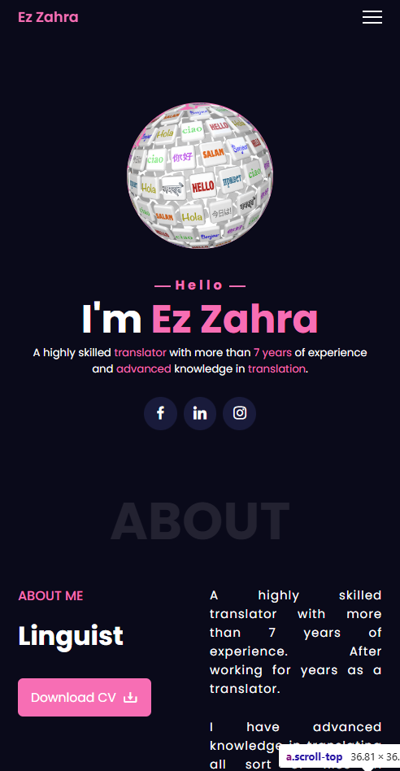

# Translator Portfolio

This is a professional portfolio website for a translator with **7+ years of experience**, designed to showcase expertise, projects, and services. Built using **HTML, CSS, and JavaScript**, it provides a clean and engaging experience for potential clients.

## 🚀 Features

- **Professional Design** – Elegant and user-friendly interface.
- **Responsive Layout** – Works seamlessly on all devices.
- **Project Showcase** – Displays previous translation work.
- **Services Section** – Highlights offered translation services.
- **Contact Form** – Easy way for clients to get in touch.

## 🛠️ Tech Stack

- **HTML** – Structure and content
- **CSS** – Styling and layout
- **JavaScript** – Interactivity and animations

## 📸 Screenshots




## 📂 Project Setup

1. Clone the repository:
   ```bash
   git clone https://github.com/yourusername/Translator-Portfolio.git
   ```
2. Navigate to the project directory:
   ```bash
   cd Translator-Portfolio
   ```
3. Open the `index.html` file in your browser.

## 📬 Contact

For any inquiries or improvements, feel free to reach out at **ahmedmlotfi@outlook.com**.

---

Made with ❤️ by **Ahmed Lotfi**
